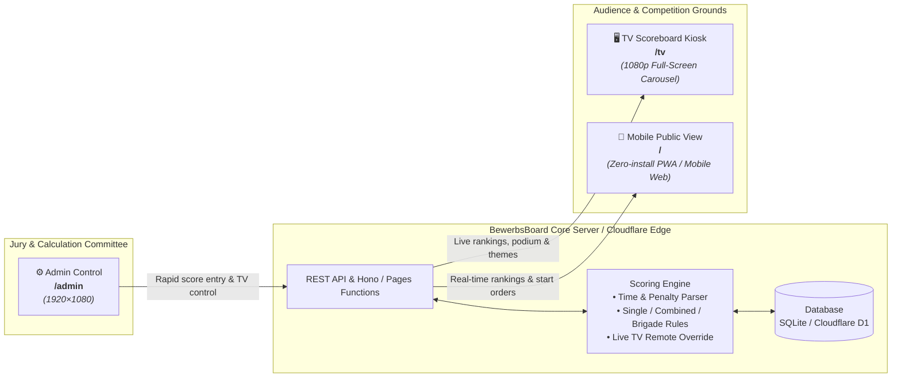

<div align="center">

# 🚒 BewerbsBoard

**Modern, real-time digital scoreboard and event management platform engineered for fire brigade competitions (*Feuerwehrleistungsbewerbe*).**

Replaces traditional paper lists and manual spreadsheets with an automated, multi-screen system designed for arena TV kiosks, mobile spectator live tracking, and rapid jury evaluation.

[](LICENSE)
[](https://react.dev)
[](https://www.typescriptlang.org)
[](https://tailwindcss.com)
[](https://vite.dev)
[](https://hono.dev)
[](https://orm.drizzle.team)
[](compose.yaml)
[](wrangler.toml)
[](package.json)

<br/>

[✨ Key Features](#-key-features) &nbsp;•&nbsp;
[📸 Interface Tour](#-interface-tour) &nbsp;•&nbsp;
[🗺️ Architecture](#%EF%B8%8F-multi-screen-architecture) &nbsp;•&nbsp;
[🚀 Quick Start](#-quick-start) &nbsp;•&nbsp;
[🐳 Deployment](#-deployment-options) &nbsp;•&nbsp;
[🛠️ Development Guide](#%EF%B8%8F-development-guide) &nbsp;•&nbsp;
[📺 TV Kiosk Setup](#-tv-display-kiosk-setup) &nbsp;•&nbsp;
[⚙️ Configuration](#%EF%B8%8F-configuration)

<br/>

<a href="docs/PREVIEW.md">
  
</a>

<p align="center">
  <sub>Unified multi-screen platform: <b>Desktop administration</b> for jury evaluation, <b>mobile live scores</b> for spectators, and <b>automated kiosk presentation</b> for arena TV walls.</sub><br/>
  👉 <b><a href="docs/PREVIEW.md">View Full Screenshot Gallery & Theme Walkthroughs &rarr;</a></b>
</p>

</div>

---

## ✨ Key Features

BewerbsBoard is purpose-built for fire brigade challenge cups and official competitions (such as Austrian/German *Feuerwehrleistungsbewerbe* / FLA & FJLA):

- ⚡ **Three Purpose-Built Views**:
  - **Public Live Scoreboard (`/`)**: Mobile-first responsive spectator portal. Live rankings, category filters, calculation breakdowns, and upcoming start lists.
  - **TV Presentation Kiosk (`/tv`)**: Full-screen automated display (`1920×1080`) that cycles rankings, features dynamic spectator QR code scan popups, and hosts a dedicated winners podium view.
  - **Admin Mission Control (`/admin`)**: Desktop control panel (`1920×1080`) with rapid keyboard score entry (*Erfassung*), group & brigade management, live TV display remote control, and audit logs.
- 🎨 **Three Built-in TV Themes**:
  - **Broadcast (Default)**: High-contrast dark theme with vibrant neon accents, tailored for indoor halls, LED walls, and livestreams.
  - **Ceremony**: Warm gold, amber, and bronze celebratory aesthetic for closing ceremonies and winner announcements.
  - **Outdoor**: Ultra-high-contrast daylight theme designed to eliminate severe glare under direct open-air sunlight.
- 🧮 **Comprehensive Evaluation Rules**:
  - **Single Discipline**: Ranks groups within a single competition category (e.g. Bronze or Silver).
  - **Group-Combined**: Sums scores of two disciplines for the same group across categories.
  - **Brigade-Combined Pairing**: Positional matching of best-ranked groups (e.g. Aktiv + Jugend) within each fire brigade.
  - Automatic time and penalty calculations (*Angriffszeit*, *Staffellauf*, penalty points, age bonus credits).
- 🔒 **Flexible Deployment & Security**:
  - **Self-Hosted Docker**: Lightweight Node.js + Hono server with SQLite (`better-sqlite3`), running with read-only rootfs, dropped capabilities, and non-root user.
  - **Built-in Authentication**: Simple username/password session auth, or pass-through enterprise SSO headers (`oauth2-proxy` / Keycloak OIDC).
  - **Serverless Cloudflare**: Native support for Cloudflare Pages Functions, D1 relational database, and Workers KV.
- 📶 **Headless Discovery & LAN Setup**:
  - Automatic server IP detection displaying a splash screen on `/tv` (`http://<IP>:<PORT>/admin`) with a QR code for instantaneous smartphone administrator onboarding without needing an external monitor or keyboard.

---

## 📸 Interface Tour

| Interface | URL | Target Hardware | Viewport | Core Purpose |
| :--- | :--- | :--- | :--- | :--- |
| **Public Live Scoreboard** | `/` | Smartphones, tablets | Responsive (`360×740+`) | Zero-install live leaderboard for spectators, coaches, and competitors. |
| **TV Presentation Mode** | `/tv` | Arena monitors, projectors, TVs | `1920×1080` (16:9) | Hands-off automated carousel, winner ceremonies, spectator QR scan panels. |
| **Admin Mission Control** | `/admin` | Laptops, workstation PCs | `1920×1080` | High-speed score entry (*Erfassung*), start order planning, remote TV controls. |

<br/>

<details>
<summary><b>👀 Click to view interface previews</b></summary>

<br/>

### 1. Arena TV Scoreboard (`/tv`)
*Full-screen kiosk mode featuring automated ranking loops, split times, and fly-in spectator onboarding QR code.*
<p align="center">
  
</p>

### 2. TV Ceremony & Outdoor Themes
*Switch themes on the fly from the admin dashboard or via URL parameter (`?theme=ceremony` / `?theme=outdoor`).*
<p align="center">
  
  
</p>

### 3. Mobile Spectator View (`/`) & Admin Dashboard (`/admin`)
<p align="center">
  
  &nbsp;&nbsp;&nbsp;&nbsp;
  
</p>

> 📖 For an exhaustive gallery with full-resolution screenshots, see **[docs/PREVIEW.md](docs/PREVIEW.md)**.

</details>

---

## 🗺️ Multi-Screen Architecture



---

## 🚀 Quick Start

### The Interactive Deployment Wizard (Recommended)

The fastest and most foolproof way to explore or install BewerbsBoard is with the interactive terminal wizard:

```bash
git clone https://github.com/itsKontra/BewerbsBoard.git
cd BewerbsBoard
./scripts/deploy-wizard.sh
```

The wizard interactively guides you through:
1. **Interactive Demo Mode** (run locally with sample competition data in seconds).
2. **Local Docker Deployment** (provisions hardened Docker Compose stack, credentials, and network detection).
3. **Cloudflare Pages Deployment** (provisions D1 database, KV namespace, and automated migrations).
4. **Keycloak / OIDC SSO** (sets up `oauth2-proxy` and reverse proxy authentication).

---

## 🐳 Deployment Options

### Option 1: Docker Compose (Local / Self-Hosted Server)

Ideal for running on a laptop, local server, or dedicated Raspberry Pi at the competition venue.

#### 1. Configure Environment
```bash
git clone https://github.com/itsKontra/BewerbsBoard.git
cd BewerbsBoard
cp example.env .env
```

Edit `.env` to configure your administrator credentials and port bindings:
```env
APP_BIND_ADDRESS=0.0.0.0
APP_PORT=3080
LOCAL_AUTH_USER=admin
LOCAL_AUTH_PASSWORD=your_secure_password
LOCAL_AUTH_SECRET=your_cookie_signing_secret
```

#### 2. Launch the Application
```bash
docker compose up -d --build
```

Verify service health:
```bash
curl --fail http://127.0.0.1:3080/healthz
```

Once running, navigate to:
- 📱 **Public Scoreboard**: `http://<your-ip>:3080/`
- 🖥️ **TV Arena Display**: `http://<your-ip>:3080/tv`
- ⚙️ **Admin Control Panel**: `http://<your-ip>:3080/admin`

> [!TIP]
> If you ran `./scripts/deploy-wizard.sh`, a unified management script `./app.sh` is generated for convenience:
> ```bash
> ./app.sh start    # Start or update the containers
> ./app.sh stop     # Stop containers (preserves data volume)
> ./app.sh delete   # Teardown stack and purge database volume
> ```

---

### Option 2: Cloudflare Pages & D1 (Serverless Edge)

Deploy globally with zero server maintenance using Cloudflare Pages Functions, D1 (relational SQLite at the edge), and Workers KV.

#### 1. Authenticate with Cloudflare
```bash
npm ci
npx wrangler login
```

#### 2. Provision Edge Resources
```bash
# Create D1 database
npx wrangler d1 create bewerbsboard

# Create KV namespace
npx wrangler kv namespace create KV
```

#### 3. Update Configuration & Deploy
Insert the returned `database_id` and KV `id` into `wrangler.toml`, then execute:

```bash
# Apply schema migrations to remote D1
npm run db:migrate:remote

# Build the client bundle
npm run build

# Deploy to Cloudflare Pages
npx wrangler pages project create bewerbsboard --production-branch main
npx wrangler pages deploy dist --project-name bewerbsboard
```

> [!NOTE]
> Cloudflare Pages deployments rely on edge authentication (such as Cloudflare Zero Trust Access or an upstream proxy) to protect `/admin` and `/api/admin/*`.

---

## 📺 TV Display Kiosk Setup

You can turn any low-cost Debian-compatible device (e.g. Raspberry Pi 4/5, Odroid, or Intel N100 mini-PC) into a dedicated TV display appliance that automatically boots into full-screen kiosk mode.

### 1. Run Automated Setup Script
```bash
chmod +x scripts/setup-debian-device.sh
./scripts/setup-debian-device.sh
sudo reboot
```
The script provisions an auto-starting Firefox session in kiosk mode targeting your scoreboard URL.

### 2. Standalone Wi-Fi & Hotspot Configuration
For remote fire grounds without venue Wi-Fi:
- 📖 [Debian Standalone Access Point / Hotspot Guide](scripts/setup-debian-hotspot.md) — Let spectators connect directly to the scoreboard server's own Wi-Fi.
- 📖 [Debian Wi-Fi Client Setup Guide](scripts/setup-debian-wifi.md) — Connect the kiosk device to an existing wireless network.

### 3. Automatic Host IP Discovery on TV
To show the host machine's actual LAN IP address directly on the TV screen (enabling zero-configuration admin access without a monitor connected to the server):
```bash
sudo install -Dm755 deploy/network-info-writer.sh /usr/local/lib/bewerbsboard/network-info-writer.sh
sudo install -Dm644 deploy/bewerbsboard-network-info.service /etc/systemd/system/bewerbsboard-network-info.service
sudo systemctl enable --now bewerbsboard-network-info.service
```
Then start Docker with the network-info overlay:
```bash
docker compose -f compose.yaml -f compose.network-info.yaml up -d
```

---

## 🛠️ Development Guide

### Prerequisites

- **Node.js**: `20.x` or higher
- **npm**: `10.x` or higher
- **Git**

### Tech Stack Overview

| Area | Technologies |
| :--- | :--- |
| **Frontend** | [React 19](https://react.dev), [Tailwind CSS v4](https://tailwindcss.com), [Vite 8](https://vite.dev), [Lucide React](https://lucide.dev) |
| **Backend & APIs** | [Hono 4](https://hono.dev), [@hono/node-server](https://github.com/honojs/node-server), [Cloudflare Pages Functions](https://developers.cloudflare.com/pages/platform/functions/) |
| **Database & ORM** | [better-sqlite3](https://github.com/WiseLibs/better-sqlite3), [Cloudflare D1](https://developers.cloudflare.com/d1/), [Drizzle ORM](https://orm.drizzle.team) |
| **Testing & Quality** | [Vitest 4](https://vitest.dev), [Playwright](https://playwright.dev), [Testing Library](https://testing-library.com), [Oxlint](https://oxc.rs) |

### Project Directory Structure

```text
BewerbsBoard/
├── src/                    # React 19 Frontend application
│   ├── features/           # Feature modules (public, tv, admin)
│   ├── components/         # Shared reusable UI components
│   ├── lib/                # Client state, API helpers & utilities
│   └── index.css           # Tailwind CSS v4 styling entrypoint
├── server/                 # Self-hosted backend (Hono + better-sqlite3)
│   ├── app.ts              # Hono application routing & middleware
│   ├── database.ts         # SQLite connection & schema migrations
│   └── local-auth.ts       # Session authentication & cookie signing
├── functions/              # Cloudflare Pages Functions (Serverless D1/KV)
├── shared/                 # Shared domain logic & database definitions
│   ├── domain/             # Scoring engine, calculation rules & lifecycles
│   ├── schema/             # Drizzle ORM schema definitions
│   └── types/              # Universal TypeScript interfaces
├── deploy/                 # Production deployment templates & systemd units
├── scripts/                # Deployment wizard, kiosk scripts & seed generators
├── tests/                  # Playwright end-to-end and screenshot test suites
├── compose.yaml            # Hardened Docker Compose configuration
└── wrangler.toml           # Cloudflare Pages configuration
```

### Development Scripts

Install all dependencies and start hacking:

```bash
npm ci
npm run dev
```

| Command | Purpose |
| :--- | :--- |
| `npm run dev` | Starts Vite local development server with HMR at `http://localhost:5173`. |
| `npm run build` | Compiles client bundle (`vite build`) and server TypeScript (`dist-server/`). |
| `npm start` | Launches production self-hosted Hono server (`node dist-server/server/index.js`). |
| `npm test` | Runs all unit and integration test suites with Vitest (`vitest run`). |
| `npm run test:watch` | Runs Vitest in interactive watch mode. |
| `npm run test:e2e` | Runs end-to-end browser tests with Playwright. |
| `npm run lint` | Runs [Oxlint](https://oxc.rs) for fast static analysis across all files. |
| `npm run preview` | Previews the compiled production client bundle locally with Vite. |
| `npm run db:generate` | Generates Drizzle migrations for Cloudflare D1. |
| `npm run db:generate:self-hosted` | Generates Drizzle migrations for self-hosted SQLite. |
| `npm run db:seed:generate` | Rebuilds seed SQL from JSON fixture data (`scripts/generate-seed-sql.mjs`). |
| `npm run db:migrate:local` | Applies migrations to local D1 emulator via Wrangler. |
| `npm run db:migrate:remote` | Applies migrations to remote Cloudflare D1 database. |
| `npm run screenshots` | Runs Playwright to capture high-res screenshots into `docs/images/`. |

### Zero-Database Demo Mode

You can inspect all screens with rich, deterministic competition demo data without running a database or backend server. Just pass `?demo=true` into any URL:

- Public Scoreboard Demo: `http://localhost:5173/?demo=true`
- TV Kiosk Demo: `http://localhost:5173/tv?demo=true`
- Admin Dashboard Demo: `http://localhost:5173/admin?demo=true`

### UI Testing Viewport Standards

When building and testing UI with Playwright, follow these viewport constraints:
- **TV View (`/tv`)** and **Admin Dashboard (`/admin`)**: Fixed **`1920×1080`** (16:9).
- **Public View (`/`)**: Mobile viewport **`360×740`**.

---

## ⚙️ Configuration

### Environment Variables Reference

When deploying self-hosted via Docker or directly with Node.js, configure the following variables in `.env`:

| Variable | Default | Description |
| :--- | :--- | :--- |
| `APP_BIND_ADDRESS` | `127.0.0.1` | Network interface IP address to bind on the host (`0.0.0.0` for all interfaces). |
| `APP_PORT` | `3080` | Port exposed on the host for HTTP traffic. |
| `PORT` | `8080` | Internal application listen port inside the container. |
| `PUBLIC_DIRECTORY` | `dist` | Path to compiled static client assets served by the Hono backend. |
| `LOCAL_AUTH_USER` | *none* | Admin username for built-in session authentication. |
| `LOCAL_AUTH_PASSWORD` | *none* | Admin password for built-in session authentication. |
| `LOCAL_AUTH_SECRET` | *auto-generated* | Secret string used to sign HMAC session cookies (set explicitly to persist sessions across restarts). |
| `OAUTH2_PROXY_OIDC_ISSUER_URL` | *none* | OIDC issuer URL when authenticating through Keycloak / external proxy. |
| `OAUTH2_PROXY_CLIENT_ID` | *none* | Client ID for Keycloak / OIDC provider. |
| `OAUTH2_PROXY_CLIENT_SECRET` | *none* | Client Secret for Keycloak / OIDC provider. |
| `OAUTH2_PROXY_COOKIE_SECRET` | *none* | Encryption secret for `oauth2-proxy` session cookies. |

---

## 📄 License

This project is open-source software licensed under the **[MIT License](LICENSE)**.

---

<div align="center">
  <sub>Engineered with precision for fire brigades everywhere. Made with ❤️ by <a href="https://github.com/itsKontra">itsKontra</a> and contributors.</sub>
</div>
