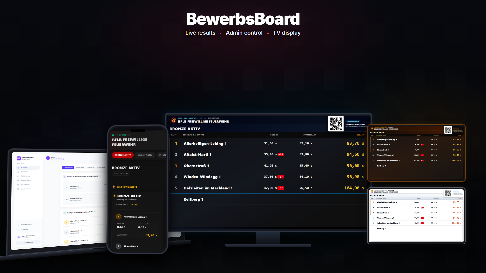
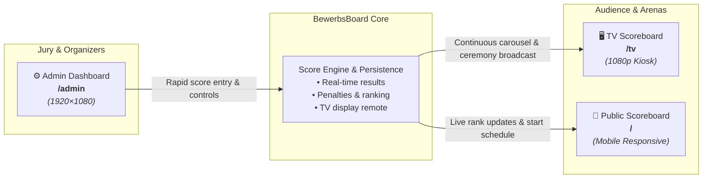
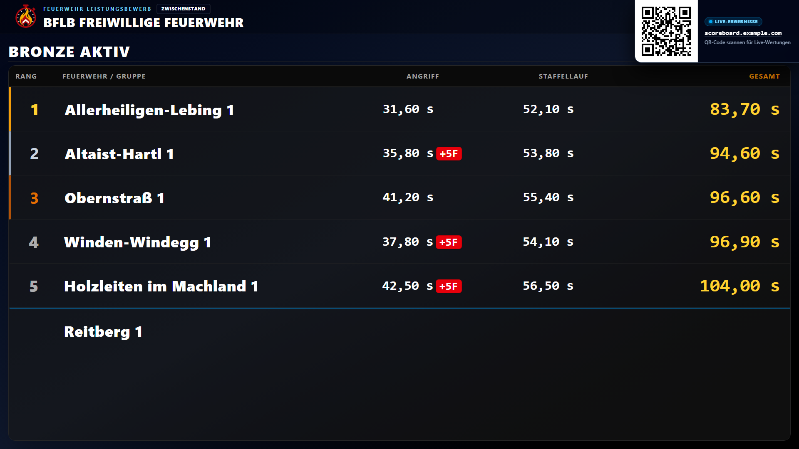
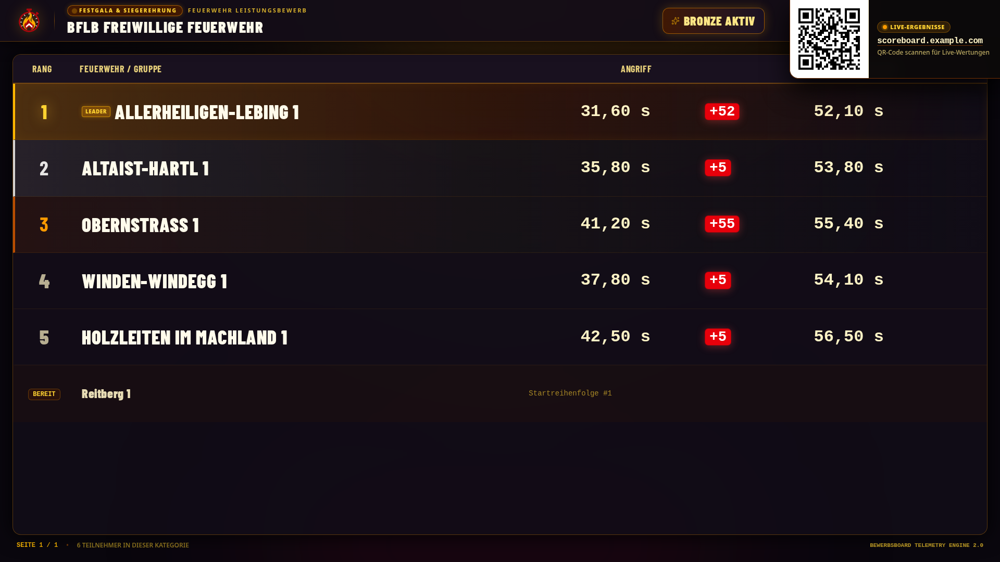
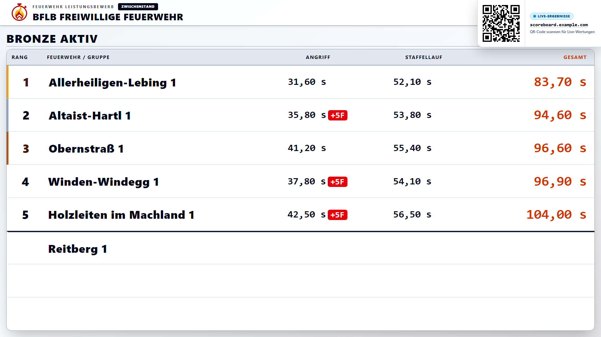
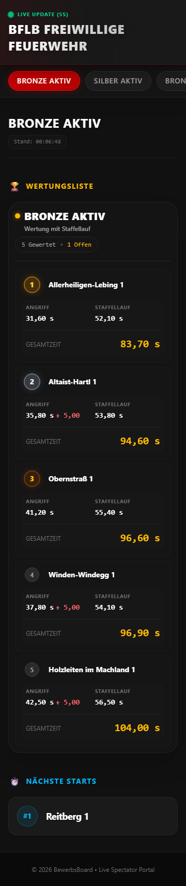
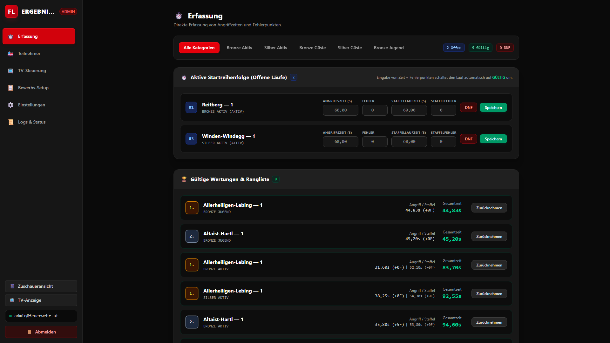

# 📸 BewerbsBoard — Visual Showcase & Interface Preview

 

  <b>A comprehensive visual tour of BewerbsBoard interfaces, responsive viewports, and presentation themes.</b>

[🖥️ TV Display](#tv-display) &nbsp;•&nbsp;
[🎨 Display Themes](#tv-themes) &nbsp;•&nbsp;
[📱 Mobile Public View](#mobile-view) &nbsp;•&nbsp;
[⚙️ Admin Dashboard](#admin-dashboard) &nbsp;•&nbsp;
[🗺️ System Architecture](#system-architecture)

 

  <em>Unified multi-screen platform: Desktop administration for jury evaluation, mobile live scores for spectators, and automated kiosk presentation for arena TV screens.</em>

---

### 🗺️ Multi-Screen System Architecture

---

## 🎯 Interface Matrix at a Glance

| View | Endpoint | Target Devices | Aspect / Viewport | Primary Purpose |
| :--- | :--- | :--- | :--- | :--- |
| **[TV Scoreboard](#tv-display)** | `/tv` | Arena monitors, TVs, projectors | `1920×1080` (16:9) | Continuous ranking loop, podium ceremonies, spectator onboarding QR codes |
| **[Mobile Public View](#mobile-view)** | `/` | Smartphones, tablets | Responsive (`360×740+`) | Zero-install live scoreboard for spectators, coaches, and competing groups |
| **[Admin Dashboard](#admin-dashboard)** | `/admin` | Laptops, desktop workstations | `1920×1080` | High-speed score entry (*Erfassung*), start orders, TV broadcast control |

---

## 🖥️ TV Display Presentation (`/tv`)

Designed for unattended operation on TVs, large arena scoreboards, and set-top boxes (such as a Raspberry Pi or Odroid running Firefox in kiosk mode).

### Key Features
- 🔄 **Automated Carousel**: Cycles dynamically through current rankings and competition categories without manual intervention.
- 🥇 **Ceremony & Winners Podium**: Dedicated celebratory view with bronze, silver, and gold rankings.
- ⏱️ **Discipline Breakdowns**: Displays single-discipline times, combined relay scores, calculation formulas, and penalty points clearly from distance.
- 📲 **Spectator Onboarding**: Features an on-screen QR code so attendees can scan and follow along on their mobile phones.

  

  <em>Figure 1: TV Scoreboard presentation mode in Broadcast theme displaying live group rankings, split times, and spectator QR onboarding.</em>

> [!TIP]
> **Live Theme Switching**: You can append `?theme=broadcast`, `?theme=ceremony`, or `?theme=outdoor` to `/tv` URL for testing, or switch themes live across all active TV displays instantly from the Admin control panel.

---

## 🎨 TV Display Themes

BewerbsBoard includes three distinct presentation themes engineered for different event phases and ambient lighting conditions:

| Theme | Target Environment | Characteristics |
| :--- | :--- | :--- |
| **1. Broadcast** | Indoor halls, gymnasiums, livestreams | High-contrast dark theme with vibrant cyan, rose, and amber accents |
| **2. Ceremony** | Award ceremonies, banquets, evening finals | Warm gold, amber, and bronze celebratory accents |
| **3. Outdoor** | Open-air grounds, direct sunlight | Ultra-high-contrast light theme to eliminate screen glare |

### 1. Broadcast Theme (Default)
*Engineered for indoor venues, TV walls, and projector broadcasts with deep blacks and high-visibility neon accents.*

  

---

### 2. Ceremony Theme
*An elegant celebratory aesthetic with warm gold and amber highlights, ideal for closing ceremonies and winner announcements.*

  

---

### 3. Outdoor Theme
*An ultra-high-contrast daylight theme designed to resist severe glare and remain readable under bright outdoor sun.*

  

---

## 📱 Mobile Public Scoreboard (`/`)

The mobile scoreboard provides instant live updates to spectators, firefighters, and coaches on the field without requiring any app store download.

  <em>Figure 2: Full mobile spectator view featuring category tabs, live ranking cards, penalty indicators, and upcoming starts timeline.</em>

### Highlights
- ⚡ **Instant Category Filtering**: Switch smoothly between Bronze, Silver, Combined, and youth categories.
- 📋 **Upcoming Starts**: Real-time start order timeline alerting upcoming groups when to report to the preparation area.
- 🔍 **Transparent Score Breakdown**: View target time, attack time, error penalties, and total points with complete clarity.
- 📶 **Offline Resilience**: Ultra-lightweight payload ensures immediate loading even over congested cellular networks at remote fire grounds.

---

## ⚙️ Administration Dashboard (`/admin`)

The central mission control for competition organizers, evaluation committees (*Berechnungsausschuss*), and jury officials.

  

  <em>Figure 3: Admin dashboard showing rapid score capture (Erfassung), active start list management, and category tabs.</em>

### Key Modules
- ⚡ **Rapid Score Entry (*Erfassung*)**: Keyboard-optimized inputs for attack times, relay times, penalty selections, and age-point deductions.
- 👥 **Brigade & Group Management**: Organize participating fire departments (*Freiwillige Feuerwehren*), assign start numbers, and track participation status.
- 📺 **TV Display Controls**: Remotely override the active display category, trigger podium views, or change visual themes across all screens.
- 🛡️ **Audit Logging & System Health**: Real-time event log tracking every score submission, modification, and system health metric.

---

## 🔗 Related Documentation & Guides

- 🚀 **[Quick Start Guide](../README.md#quick-start-the-easy-way)** — Set up a demo or local instance in under 2 minutes.
- 🐳 **[Docker Deployment Guide](../README.md#manual-deployment)** — Run BewerbsBoard on your own server or Raspberry Pi.
- 📺 **[TV Kiosk Mode Setup](../README.md#tv-display-set-top-box-setup)** — Configure Debian or Raspberry Pi OS to boot directly into TV mode.
- 🛠️ **[Developer Guide](../README.md#development-guide)** — Run the test suite and explore the codebase structure.

---

  

    <a href="../README.md">← Back to Main README</a> &nbsp;•&nbsp; <a href="#">Back to Top ↑</a>
  

