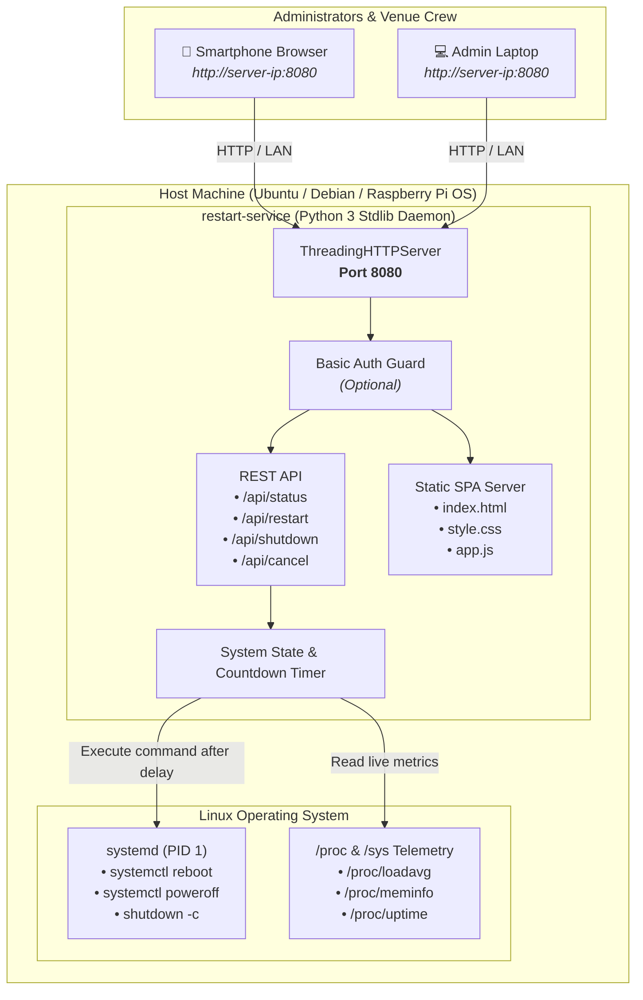

# ⚡ Host Restart & Shutdown Web Service

<div align="center">

**Lightweight, zero-dependency host power management and telemetry service engineered for Linux and Ubuntu headless competition appliances.**

[](https://ubuntu.com)
[](https://www.python.org)
[](#-zero-external-dependencies)
[](#-systemd-service-integration)
[](../LICENSE)

<br/>

[✨ Features](#-features) &nbsp;•&nbsp;
[🗺️ Architecture](#%EF%B8%8F-service-architecture) &nbsp;•&nbsp;
[🚀 Quick Start](#-quick-start-automated-installer) &nbsp;•&nbsp;
[⚙️ Configuration](#%EF%B8%8F-configuration-reference) &nbsp;•&nbsp;
[📡 REST API](#-rest-api-reference) &nbsp;•&nbsp;
[🔒 Security](#-security--safety-mechanisms) &nbsp;•&nbsp;
[🛠️ Service Management](#%EF%B8%8F-service-management)

</div>

---

## 📖 Overview

When operating **BewerbsBoard** on headless venue hardware (e.g. Raspberry Pi 4/5, Intel N100 mini-PCs, or rackmount Linux servers) at a competition arena, physical access or SSH connections are often inconvenient or restricted.

The **Host Restart & Shutdown Web Service** provides an isolated, resilient HTTP daemon with a standalone single-page web interface. Event administrators can reboot the machine, perform an orderly poweroff, view live hardware telemetry, or cancel pending actions from any smartphone or browser on the local network.

---

## ✨ Features

- 🔄 **Reboot & Shutdown Controls**: Issue immediate or grace-period delayed reboot and shutdown commands to the operating system.
- ⏱️ **Graceful Countdown & Abort**: Configurable countdown (e.g. 5s, 10s, 30s, 60s) with an active screen banner and **one-click Cancel** button to prevent accidental disruptions.
- 📊 **Real-Time Host Telemetry**: Live polling of hostname, OS release, kernel version, system uptime, CPU load averages (1m / 5m / 15m), and RAM utilization with dynamic visual gauge.
- 🔁 **Automatic Reconnection Watchdog**: During reboots, the client interface automatically pings the host endpoint and seamlessly reconnects the moment the operating system returns online.
- 🪶 **Zero External Dependencies**: Built entirely with Python 3's standard library (`http.server.ThreadingHTTPServer`, `socket`, `subprocess`). No `pip install`, virtual environment conflicts, or external packages required.
- 🛡️ **Optional HTTP Basic Auth**: Secure administrative endpoints with username/password authentication.
- 🧪 **Automatic Dry-Run Mode**: Safely simulates reboots and poweroffs when running in unprivileged environments, macOS, or local development machines.
- 📦 **Native Systemd Integration**: Pre-configured systemd unit file, automated installer (`install.sh`), and uninstaller (`uninstall.sh`).

---

## 🗺️ Service Architecture



---

## 🚀 Quick Start (Automated Installer)

The automated installer provisions the daemon to `/opt/restart-service/`, sets up configuration in `/etc/restart-service/config.json`, and enables the systemd unit.

```bash
# Navigate to the repository root
cd BewerbsBoard/restart-service

# Run the installer (optionally specify port, defaults to 8080)
sudo bash scripts/install.sh 8080
```

Once installed, the service begins serving immediately:
- **Local Access**: `http://localhost:8080`
- **Venue LAN Access**: `http://<YOUR_SERVER_IP>:8080`

---

## 🛠️ Manual Installation

If you prefer to configure system services manually:

### 1. Copy Application Files
```bash
sudo mkdir -p /opt/restart-service /etc/restart-service
sudo cp server.py /opt/restart-service/
sudo cp -r static /opt/restart-service/
sudo cp config.json.example /etc/restart-service/config.json
sudo chmod +x /opt/restart-service/server.py
sudo chmod 600 /etc/restart-service/config.json
```

### 2. Configure Systemd Service
```bash
sudo cp systemd/restart-service.service /etc/systemd/system/
sudo systemctl daemon-reload
sudo systemctl enable --now restart-service.service
```

### 3. Verify Status
```bash
sudo systemctl status restart-service.service
```

---

## ⚙️ Configuration Reference

The service resolves configuration in order of precedence:
1. **CLI Arguments**: `--port 8080`, `--host 0.0.0.0`, `--dry-run`, `--auth`, `--delay 10`, `--config /path/to/config.json`
2. **Environment Variables**: `PORT`, `HOST`, `DRY_RUN`, `AUTH_ENABLED`, `AUTH_USERNAME`, `AUTH_PASSWORD`, `CONFIG_PATH`
3. **Configuration File**: `/etc/restart-service/config.json` or `./config.json`
4. **Built-in Defaults**

### Configuration File (`/etc/restart-service/config.json`)

```json
{
  "host": "0.0.0.0",
  "port": 8080,
  "auth_enabled": false,
  "username": "admin",
  "password": "changeme_to_secure_password",
  "default_delay_seconds": 5,
  "allow_cancel": true,
  "dry_run": false,
  "reboot_command": "systemctl reboot",
  "shutdown_command": "systemctl poweroff",
  "cancel_command": "shutdown -c"
}
```

### Parameters Breakdown

| Field | Type | Default | Description |
| :--- | :--- | :--- | :--- |
| `host` | `string` | `"0.0.0.0"` | Network interface to bind (`0.0.0.0` binds to all LAN interfaces). |
| `port` | `number` | `8080` | Port to serve the web interface and REST API. |
| `auth_enabled` | `boolean` | `false` | Enable HTTP Basic Authentication challenge. |
| `username` | `string` | `"admin"` | Username required when authentication is enabled. |
| `password` | `string` | `"changeme"` | Password required when authentication is enabled. |
| `default_delay_seconds`| `number` | `5` | Default grace period delay in seconds before command executes. |
| `allow_cancel` | `boolean` | `true` | Allows user to abort an active countdown before execution. |
| `dry_run` | `boolean` | `false` | When true, simulates actions without executing OS reboot/shutdown. |
| `reboot_command` | `string` | `"systemctl reboot"` | System command executed for reboots. |
| `shutdown_command` | `string` | `"systemctl poweroff"` | System command executed for shutdowns. |
| `cancel_command` | `string` | `"shutdown -c"` | System command executed when cancelling OS-level scheduled actions. |

---

## 📡 REST API Reference

All endpoints consume and produce UTF-8 `application/json`.

### `GET /api/status`
Returns live system health, hardware telemetry, and active countdown state.

**Example Response:**
```json
{
  "status": "online",
  "host": {
    "hostname": "arena-tv-kiosk",
    "os_name": "Ubuntu 24.04 LTS",
    "kernel": "6.8.0-31-generic",
    "architecture": "x86_64",
    "python_version": "3.12.3"
  },
  "uptime_seconds": 184520.4,
  "service_uptime_seconds": 3600.2,
  "cpu": {
    "cores": 4,
    "load_1m": 0.12,
    "load_5m": 0.08,
    "load_15m": 0.05
  },
  "memory": {
    "total_bytes": 16777216000,
    "available_bytes": 12582912000,
    "used_bytes": 4194304000,
    "used_percent": 25.0
  },
  "scheduled_action": null,
  "dry_run": false,
  "allow_cancel": true,
  "server_time": 1787850240.0
}
```

---

### `POST /api/restart`
Schedules an operating system reboot with an optional delay in seconds.

**Request Payload:**
```json
{
  "delay": 10
}
```

**Curl Command:**
```bash
curl -X POST http://localhost:8080/api/restart \
  -H "Content-Type: application/json" \
  -d '{"delay": 10}'
```

---

### `POST /api/shutdown`
Schedules an operating system poweroff with an optional delay in seconds.

**Request Payload:**
```json
{
  "delay": 10
}
```

**Curl Command:**
```bash
curl -X POST http://localhost:8080/api/shutdown \
  -H "Content-Type: application/json" \
  -d '{"delay": 10}'
```

---

### `POST /api/cancel`
Aborts an active countdown before the system command triggers.

**Curl Command:**
```bash
curl -X POST http://localhost:8080/api/cancel \
  -H "Content-Type: application/json"
```

---

### `GET /api/ping`
Fast heartbeat probe for load balancers, health checks, and reconnect monitors.

**Curl Command:**
```bash
curl http://localhost:8080/api/ping
# {"status": "ok", "timestamp": 1787850240.0}
```

---

## 🔒 Security & Safety Mechanisms

1. **Native Dialog Confirmations**: The frontend forces explicit confirmation before issuing reboot or shutdown commands.
2. **Path Traversal Protection**: Static asset handlers reject any request attempting relative path traversal (`..`), absolute directory escapes, or unauthorized file access.
3. **Constant-Time Auth Evaluation**: Basic Auth credentials are validated using `secrets.compare_digest()` to eliminate side-channel timing attacks.
4. **Input Sanitization**: Delay parameters are strictly validated as non-negative integers under 86,400 seconds (24 hours).
5. **Config File Permissions**: Configuration containing credentials is restricted to `chmod 600` (root read/write only).

---

## 🖥️ Service Management

Use standard `systemctl` and `journalctl` commands:

```bash
# View live service logs
sudo journalctl -u restart-service -f

# Restart the service daemon
sudo systemctl restart restart-service

# Stop the service daemon
sudo systemctl stop restart-service

# Inspect service status
sudo systemctl status restart-service
```

### Local Development / Dry-Run Testing

You can run the service directly without installing system files:

```bash
# Start in dry-run mode on port 8080
python3 server.py --port 8080 --dry-run
```

### Running Test Suite

```bash
python3 -m unittest discover -s tests -p "test_*.py" -v
```

---

## 🗑️ Uninstallation

To cleanly stop the daemon, remove the systemd unit, and purge application files:

```bash
cd BewerbsBoard/restart-service
sudo bash scripts/uninstall.sh
```
